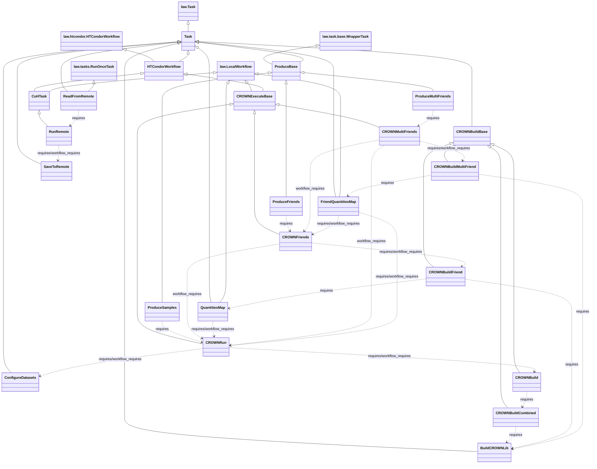

# Processor Class Hierarchy and Connections

This AI generated diagram shows Python classes in `processor/` and their inheritance hierarchy along with task dependency links.
The top-most parent classes are from the `law` library.

## Key Workflows

- **CROWN Ntuple Production**: `ProduceSamples` → `CROWNRun` ← `CROWNBuild` ← `BuildCROWNLib`
- **CROWN Friend Production**: `ProduceFriends` → `CROWNFriends` ← `CROWNBuildFriend` ← `QuantitiesMap` ← `CROWNRun`
- **CROWN Multi-Friend Production**: `ProduceMultiFriends` → `CROWNMultiFriends` combos `CROWNFriends` and `CROWNRun`

## Relationship Legend

- **`<|--`** = Inheritance (solid triangle)
- **`..>`** = Task dependency via `requires()` or `workflow_requires()` (dashed arrow)

