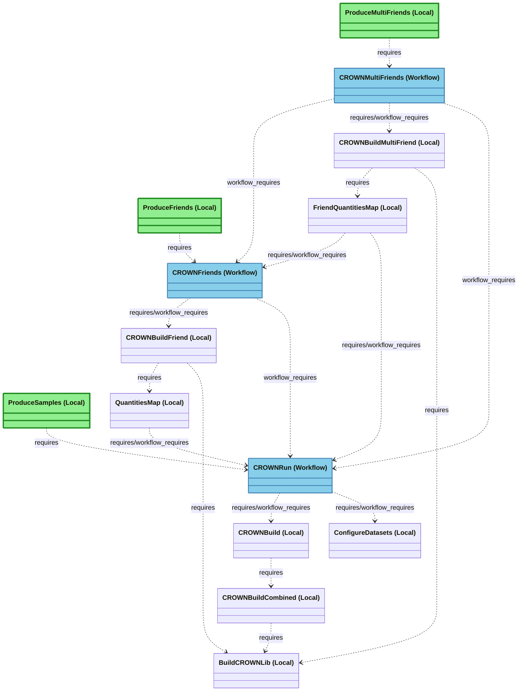

# Processor Task Dependencies

This diagram shows only the task dependencies (requires/workflow_requires) between Python classes in `processor/`.
These are the actual execution flow dependencies that determine task ordering.

## Legend

- **`..>`** = Task dependency via `requires()` or `workflow_requires()` (dashed arrow)
- **`(Workflow)`** = Workflow task inheriting from `HTCondorWorkflow` (executes on remote cluster)
- **`(Local)`** = Local task (does not inherit from `HTCondorWorkflow`)

## Key Task Flows

### CROWN Ntuple Production
```
ProduceSamples 
  → CROWNRun 
    ← CROWNBuild 
      ← BuildCROWNLib
    ← ConfigureDatasets
```

### CROWN Friend Production
```
ProduceFriends 
  → CROWNFriends 
    ← CROWNBuildFriend 
      ← BuildCROWNLib
      ← QuantitiesMap 
        ← CROWNRun
```

### CROWN Multi-Friend Production
```
ProduceMultiFriends 
  → CROWNMultiFriends 
    ← CROWNRun
    ← CROWNBuildMultiFriend 
      ← BuildCROWNLib
      ← FriendQuantitiesMap 
        ← CROWNRun
        ← CROWNFriends
    ← CROWNFriends
```




## Task Classification

### Top-Level Tasks (Entry Points) — Green boxes
Entry points that have no incoming dependencies. Users call these to start workflows:
- **ProduceSamples**: Triggers ntuple production for a list of samples
- **ProduceFriends**: Triggers friend production for a list of samples
- **ProduceMultiFriends**: Triggers multi-friend production for a list of samples

All three are **Local** tasks (do not inherit from `HTCondorWorkflow`), meaning they execute on the submission machine and orchestrate remote workflow tasks.

### Workflow Tasks — Blue boxes
Tasks that inherit from `HTCondorWorkflow`, meaning they submit jobs to run on HTCondor cluster:
- **CROWNRun**: Executes CROWN ntuple production on remote cluster
- **CROWNFriends**: Executes CROWN friend production on remote cluster
- **CROWNMultiFriends**: Executes CROWN multi-friend production on remote cluster

### Local Tasks
All other tasks are Local (do not inherit from `HTCondorWorkflow`), meaning they execute on the submission machine:
- Build tasks (`CROWNBuild*`, `BuildCROWNLib`) which are responsible to build tar archives. Those are needed by the remote workflows to provide them with all the tools/files they need.
- Configuration tasks (`ConfigureDatasets`)
- Quantities map aggregation tasks (`QuantitiesMap`, `FriendQuantitiesMap`)
