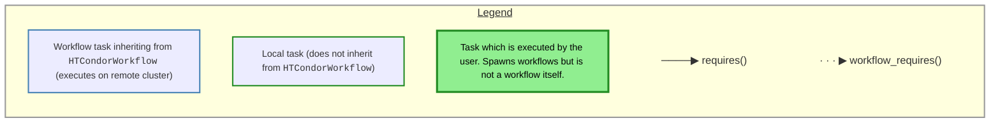
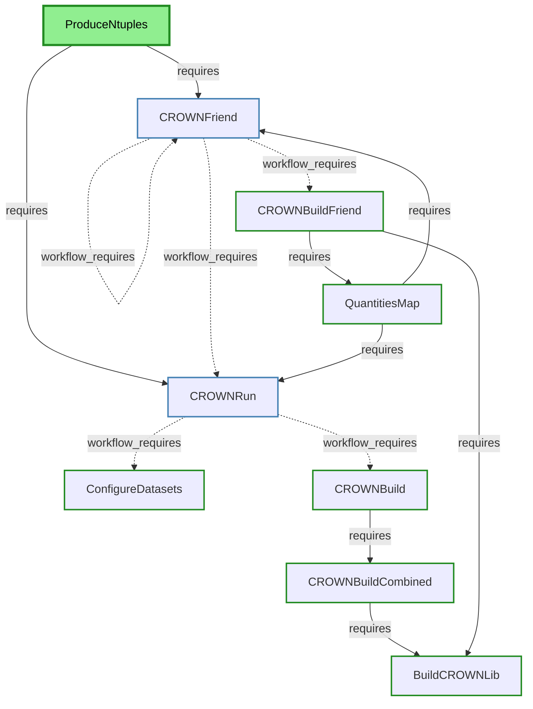
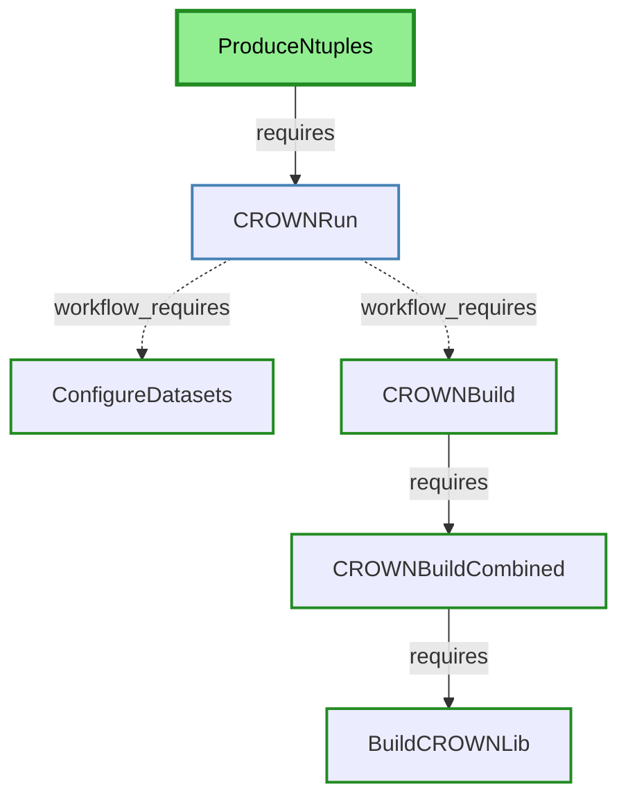
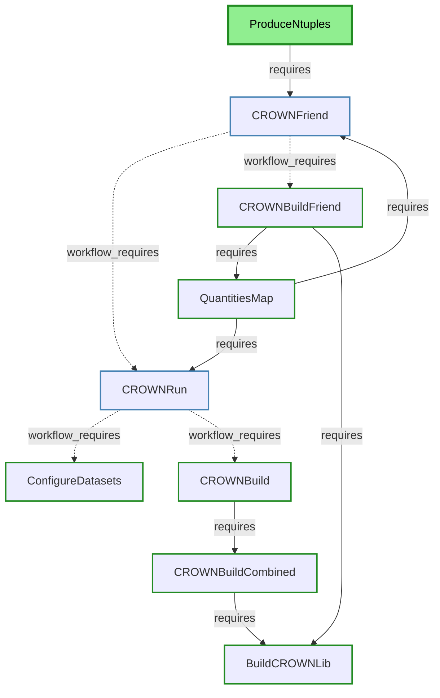

# Processor Task Dependencies

This diagram shows only the task dependencies (requires/workflow_requires) between Python classes in `processor/`.
These are the actual execution flow dependencies that determine task ordering.

## Reduced Task Flows

### CROWN Ntuple Production

Click to expand CROWN Ntuple Production flow details

### CROWN Friend Production

Click to expand CROWN Friend Production flow details

## Task Classification

### Top-Level Task (Entry Point) — Green box
Entry point that has no incoming dependencies. Users call this to start workflows:
- **ProduceNtuples**: Unified task that triggers either ntuple production (via `CROWNRun`) or friend production (via `CROWNFriend`) based on the `friend_config` parameter. When `friend_config=""` (empty, default), it triggers ntuple production. When `friend_config` is set to a specific configuration, it triggers friend production. Can handle multi-friend scenarios through the `friend_mapping` parameter.

**Local** task (does not inherit from `HTCondorWorkflow`), meaning it executes on the submission machine and orchestrates remote workflow tasks.

### Workflow Tasks — Blue boxes
Tasks that inherit from `HTCondorWorkflow`, meaning they submit jobs to run on HTCondor cluster:
- **CROWNRun**: Executes CROWN ntuple production on remote cluster
- **CROWNFriend**: Executes CROWN friend production on remote cluster, can handle friend dependencies through `friend_mapping`

### Local Tasks
All other tasks are Local (do not inherit from `HTCondorWorkflow`), meaning they execute on the submission machine:
- Build tasks (`CROWNBuild*`, `BuildCROWNLib`) which are responsible for building tar archives. Those are needed by the remote workflows to provide them with all the tools/files they need.
- Configuration tasks (`ConfigureDatasets`)
- Quantities map extraction tasks (`QuantitiesMap`)
