# Processor Class Inheritance Hierarchy

This diagram shows the inheritance relationships (parent-child) between Python classes in `processor/`.
The top-most parent classes are from the `law` library.

```mermaid
flowchart TD
  %% LAW Library Base Classes
  LawTask["law.Task"]
  LawLocalWorkflow["law.LocalWorkflow"]
  LawHTCondorWorkflow["law.htcondor.HTCondorWorkflow"]
  LawWrapperTask["law.task.base.WrapperTask"]

  %% Framework Base Classes
  Task["Task"]
  HTCondorWorkflow["HTCondorWorkflow"]

  %% CROWN Base Classes
  ProduceBase["ProduceBase"]
  CROWNExecuteBase["CROWNExecuteBase"]
  CROWNBuildBase["CROWNBuildBase"]

  %% CROWN Ntuple Production Tasks
  ProduceSamples["ProduceSamples"]
  CROWNRun["CROWNRun"]
  ConfigureDatasets["ConfigureDatasets"]
  CROWNBuildCombined["CROWNBuildCombined"]
  CROWNBuild["CROWNBuild"]
  BuildCROWNLib["BuildCROWNLib"]

  %% CROWN Friend Production Tasks
  ProduceFriends["ProduceFriends"]
  CROWNFriends["CROWNFriends"]
  CROWNBuildFriend["CROWNBuildFriend"]
  QuantitiesMap["QuantitiesMap"]

  %% CROWN Multi-Friend Production Tasks
  ProduceMultiFriends["ProduceMultiFriends"]
  CROWNMultiFriends["CROWNMultiFriends"]
  CROWNBuildMultiFriend["CROWNBuildMultiFriend"]
  FriendQuantitiesMap["FriendQuantitiesMap"]

  %% Connections and Arrows
  %% The more --- in the arrow, the longer the arrow gets. This is important for better visibility of the graph.
  LawTask --> Task

  LawHTCondorWorkflow ---> HTCondorWorkflow
  Task --> HTCondorWorkflow
  HTCondorWorkflow --> CROWNExecuteBase

  LawLocalWorkflow ----> CROWNExecuteBase
  LawLocalWorkflow -----> QuantitiesMap
  LawLocalWorkflow -----> FriendQuantitiesMap

  Task ----> QuantitiesMap
  Task ----> FriendQuantitiesMap

  Task ----> BuildCROWNLib
  Task ----> ConfigureDatasets
  Task ---> CROWNBuildBase
  Task ---> ProduceBase

  CROWNBuildBase --> CROWNBuildFriend
  CROWNBuildBase --> CROWNBuildMultiFriend
  CROWNBuildBase --> CROWNBuild
  CROWNBuildBase --> CROWNBuildCombined

  ProduceBase --> ProduceFriends
  ProduceBase --> ProduceMultiFriends
  ProduceBase --> ProduceSamples

  CROWNExecuteBase --> CROWNRun
  CROWNExecuteBase --> CROWNFriends
  CROWNExecuteBase --> CROWNMultiFriends

  LawWrapperTask ----> ProduceBase

  %% Add Links to the classes
  click LawTask https://github.com/riga/law/blob/master/law/task/base.py "https://github.com/riga/law/blob/master/law/task/base.py"
  click LawLocalWorkflow https://law.readthedocs.io/en/latest/api/workflow/local.html "https://law.readthedocs.io/en/latest/api/workflow/local.html"
  click LawHTCondorWorkflow https://law.readthedocs.io/en/latest/contrib/htcondor.html "https://law.readthedocs.io/en/latest/contrib/htcondor.html"
  
  click Task https://github.com/KIT-CMS/KingMaker/blob/main/processor/framework.py "https://github.com/KIT-CMS/KingMaker/blob/main/processor/framework.py"
  click HTCondorWorkflow https://github.com/KIT-CMS/KingMaker/blob/main/processor/framework.py "https://github.com/KIT-CMS/KingMaker/blob/main/processor/framework.py"
  
  click ProduceBase https://github.com/KIT-CMS/KingMaker/blob/main/processor/tasks/CROWNBase.py "https://github.com/KIT-CMS/KingMaker/blob/main/processor/tasks/CROWNBase.py"
  click CROWNExecuteBase https://github.com/KIT-CMS/KingMaker/blob/main/processor/tasks/CROWNBase.py "https://github.com/KIT-CMS/KingMaker/blob/main/processor/tasks/CROWNBase.py"
  click CROWNBuildBase https://github.com/KIT-CMS/KingMaker/blob/main/processor/tasks/CROWNBase.py "https://github.com/KIT-CMS/KingMaker/blob/main/processor/tasks/CROWNBase.py"
  
  click ProduceSamples https://github.com/KIT-CMS/KingMaker/blob/main/processor/tasks/ProduceSamples.py "https://github.com/KIT-CMS/KingMaker/blob/main/processor/tasks/ProduceSamples.py"
  click CROWNRun https://github.com/KIT-CMS/KingMaker/blob/main/processor/tasks/CROWNRun.py "https://github.com/KIT-CMS/KingMaker/blob/main/processor/tasks/CROWNRun.py"
  click ConfigureDatasets https://github.com/KIT-CMS/KingMaker/blob/main/processor/tasks/ConfigureDatasets.py "https://github.com/KIT-CMS/KingMaker/blob/main/processor/tasks/ConfigureDatasets.py"
  click CROWNBuildCombined https://github.com/KIT-CMS/KingMaker/blob/main/processor/tasks/CROWNBuild.py "https://github.com/KIT-CMS/KingMaker/blob/main/processor/tasks/CROWNBuild.py"
  click CROWNBuild https://github.com/KIT-CMS/KingMaker/blob/main/processor/tasks/CROWNBuild.py "https://github.com/KIT-CMS/KingMaker/blob/main/processor/tasks/CROWNBuild.py"
  click BuildCROWNLib https://github.com/KIT-CMS/KingMaker/blob/main/processor/tasks/BuildCROWNLib.py "https://github.com/KIT-CMS/KingMaker/blob/main/processor/tasks/BuildCROWNLib.py"
  
  click ProduceFriends https://github.com/KIT-CMS/KingMaker/blob/main/processor/tasks/ProduceFriends.py "https://github.com/KIT-CMS/KingMaker/blob/main/processor/tasks/ProduceFriends.py"
  click CROWNFriends https://github.com/KIT-CMS/KingMaker/blob/main/processor/tasks/CROWNFriends.py "https://github.com/KIT-CMS/KingMaker/blob/main/processor/tasks/CROWNFriends.py"
  click CROWNBuildFriend https://github.com/KIT-CMS/KingMaker/blob/main/processor/tasks/CROWNBuildFriend.py "https://github.com/KIT-CMS/KingMaker/blob/main/processor/tasks/CROWNBuildFriend.py"
  click QuantitiesMap https://github.com/KIT-CMS/KingMaker/blob/main/processor/tasks/QuantitiesMap.py "https://github.com/KIT-CMS/KingMaker/blob/main/processor/tasks/QuantitiesMap.py"
  
  click ProduceMultiFriends https://github.com/KIT-CMS/KingMaker/blob/main/processor/tasks/ProduceMultiFriends.py "https://github.com/KIT-CMS/KingMaker/blob/main/processor/tasks/ProduceMultiFriends.py"
  click CROWNMultiFriends https://github.com/KIT-CMS/KingMaker/blob/main/processor/tasks/CROWNMultiFriends.py "https://github.com/KIT-CMS/KingMaker/blob/main/processor/tasks/CROWNMultiFriends.py"
  click CROWNBuildMultiFriend https://github.com/KIT-CMS/KingMaker/blob/main/processor/tasks/CROWNBuildMultiFriend.py "https://github.com/KIT-CMS/KingMaker/blob/main/processor/tasks/CROWNBuildMultiFriend.py"
  click FriendQuantitiesMap https://github.com/KIT-CMS/KingMaker/blob/main/processor/tasks/FriendQuantitiesMap.py "https://github.com/KIT-CMS/KingMaker/blob/main/processor/tasks/FriendQuantitiesMap.py"
```

